# Decision Trees — .NET Architect's One-Hour Synthesis

This file summarises and routes; canonical wording lives in `docs/<NN>-*.md`.
Where this file and a chapter disagree, the chapter wins.

This page collects the highest-leverage decisions a senior .NET architect
actually makes on a greenfield or migrating service.
Each tree gives the trigger, the cost of the wrong call, the Mermaid flow,
and a pointer back to the owning chapter — go there before you argue with
the tree.

---

## 1. Minimal API vs MVC controllers

- Trigger: new HTTP surface, or a Framework/MVC port landing on .NET 10.
- Cost of wrong call: a controller-shaped codebase that pays MVC's
  filter/model-binder tax for endpoints that did not need it, or a Minimal
  API estate that re-implements MVC pipelines badly when the team grows past
  a handful of endpoints.
- Default per `ch02`: Minimal API for new services; keep MVC where filters,
  model binders, conventions, or an existing `Controller` hierarchy already
  earn their keep.

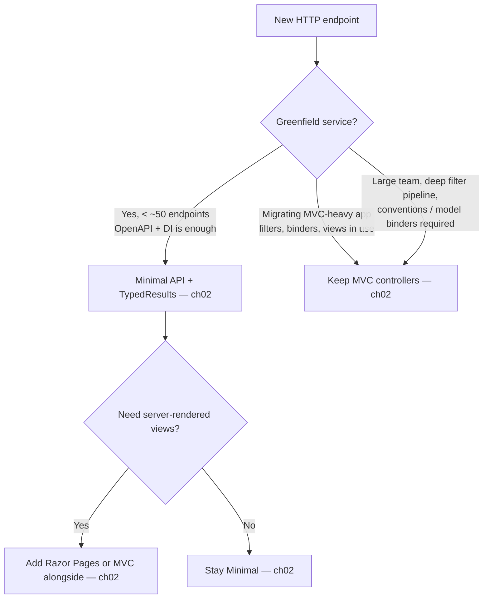
```mermaid
flowchart TD
    A[New HTTP endpoint] --> B{Greenfield service?}
    B -->|Yes, < ~50 endpoints<br/>OpenAPI + DI is enough| C[Minimal API + TypedResults — ch02]
    B -->|Migrating MVC-heavy app<br/>filters, binders, views in use| D[Keep MVC controllers — ch02]
    B -->|Large team, deep filter pipeline,<br/>conventions / model binders required| D
    C --> E{Need server-rendered views?}
    E -->|Yes| F[Add Razor Pages or MVC alongside — ch02]
    E -->|No| G[Stay Minimal — ch02]
```

References: [`docs/02-aspnetcore.md#1-minimal-apis-vs-controllers`](./02-aspnetcore.md#1-minimal-apis-vs-controllers).

---

## 2. EF Core vs Dapper vs ADO.NET

- Trigger: choosing the data access stack for a new service or a hot path
  inside an existing one.
- Cost of wrong call: losing the change tracker, migrations, and provider
  abstraction "for perf" and shipping bad SQL instead; or paying EF's
  materialisation cost on a 10k-RPS read path that wanted a 30-line `SELECT`.
- Default per `ch03`: EF Core. Dapper is a scalpel for measured hot paths.
  Raw `Microsoft.Data.SqlClient` / `Npgsql` is an escape hatch.

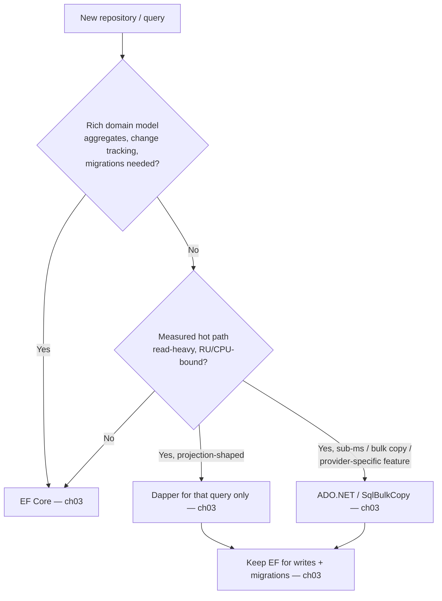
```mermaid
flowchart TD
    A[New repository / query] --> B{Rich domain model<br/>aggregates, change tracking,<br/>migrations needed?}
    B -->|Yes| C[EF Core — ch03]
    B -->|No| D{Measured hot path<br/>read-heavy, RU/CPU-bound?}
    D -->|Yes, projection-shaped| E[Dapper for that query only — ch03]
    D -->|Yes, sub-ms / bulk copy /<br/>provider-specific feature| F[ADO.NET / SqlBulkCopy — ch03]
    D -->|No| C
    E --> G[Keep EF for writes + migrations — ch03]
    F --> G
```

References: [`docs/03-data.md#1-choosing-the-tool`](./03-data.md#1-choosing-the-tool).

---

## 3. SQL Server vs PostgreSQL vs Cosmos DB

- Trigger: picking the relational/document engine for a new bounded context.
- Cost of wrong call: relational schema on a per-key global workload (Cosmos
  territory), or a document store under ad-hoc joins, becomes a rewrite —
  not a migration.
- Default per `ch03`: PostgreSQL on Azure unless a hard reason picks
  otherwise; SQL Server when the org already runs it; Cosmos when the access
  pattern is point-read at global scale.

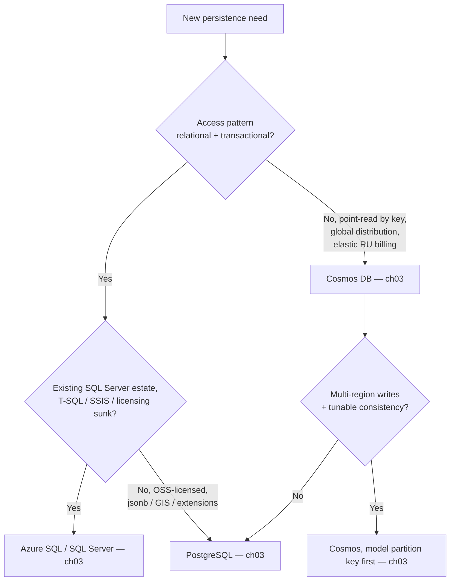
```mermaid
flowchart TD
    A[New persistence need] --> B{Access pattern<br/>relational + transactional?}
    B -->|Yes| C{Existing SQL Server estate,<br/>T-SQL / SSIS / licensing sunk?}
    B -->|No, point-read by key,<br/>global distribution,<br/>elastic RU billing| D[Cosmos DB — ch03]
    C -->|Yes| E[Azure SQL / SQL Server — ch03]
    C -->|No, OSS-licensed,<br/>jsonb / GIS / extensions| F[PostgreSQL — ch03]
    D --> G{Multi-region writes<br/>+ tunable consistency?}
    G -->|Yes| H[Cosmos, model partition key first — ch03]
    G -->|No| F
```

References: [`docs/03-data.md#1-choosing-the-tool`](./03-data.md#1-choosing-the-tool), [`docs/03-data.md#8-provider-notes`](./03-data.md#8-provider-notes).

---

## 4. EF Core migration deploy strategy

- Trigger: shipping a schema change to an environment you do not own a shell
  on.
- Cost of wrong call: `Database.Migrate()` on app startup races N replicas,
  needs DDL rights in prod, and hides the diff from the DBA; hand-written
  scripts drift from the model.
- Default per `ch03`: `dotnet ef migrations bundle` as the promoted artefact;
  generated SQL scripts when a DBA must review; `Database.Migrate()` only on
  a single-instance dev box.

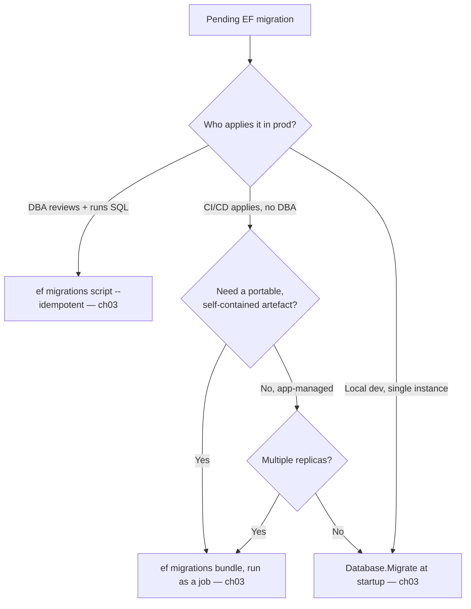
```mermaid
flowchart TD
    A[Pending EF migration] --> B{Who applies it in prod?}
    B -->|DBA reviews + runs SQL| C[ef migrations script --idempotent — ch03]
    B -->|CI/CD applies, no DBA| D{Need a portable,<br/>self-contained artefact?}
    B -->|Local dev, single instance| E[Database.Migrate at startup — ch03]
    D -->|Yes| F[ef migrations bundle, run as a job — ch03]
    D -->|No, app-managed| G{Multiple replicas?}
    G -->|Yes| F
    G -->|No| E
```

References: [`docs/03-data.md#4-migrations`](./03-data.md#4-migrations).

---

## 5. Blazor render mode

- Trigger: new page or component in a Blazor Web App on .NET 8+.
- Cost of wrong call: Interactive Server on a high-latency or offline path
  burns the SignalR circuit; WebAssembly on a security-sensitive page ships
  logic and tokens to the browser; Auto without a budget doubles your
  surface area.
- Default per `ch07`: SSR for content; Interactive Server for back-office
  with low latency; WebAssembly when offline or when you need to offload the
  server; Auto only when both modes are already supported.

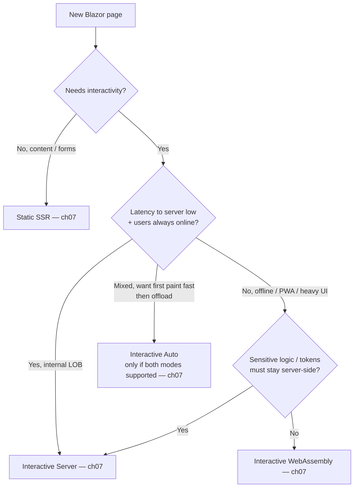
```mermaid
flowchart TD
    A[New Blazor page] --> B{Needs interactivity?}
    B -->|No, content / forms| C[Static SSR — ch07]
    B -->|Yes| D{Latency to server low<br/>+ users always online?}
    D -->|Yes, internal LOB| E[Interactive Server — ch07]
    D -->|No, offline / PWA / heavy UI| F{Sensitive logic / tokens<br/>must stay server-side?}
    F -->|Yes| E
    F -->|No| G[Interactive WebAssembly — ch07]
    D -->|Mixed, want first paint fast<br/>then offload| H[Interactive Auto<br/>only if both modes supported — ch07]
```

References: [`docs/07-client.md#part-1--blazor-unified-web-app-model`](./07-client.md#part-1-blazor-unified-web-app-model).

---

## 6. Client platform: MAUI vs PWA vs Avalonia vs Uno vs native

- Trigger: a new client app that must run somewhere other than a browser
  tab.
- Cost of wrong call: MAUI on a Linux-desktop target it does not support;
  PWA where the customer wanted deep native APIs; Avalonia/Uno on a team
  that has never shipped XAML.
- Default per `ch07`: PWA first if the browser will do; MAUI for
  iOS/Android/Win/Mac with a Microsoft-stack team; Avalonia or Uno when
  Linux desktop or pixel-identical cross-platform is the requirement;
  native only when a single platform's APIs dominate.

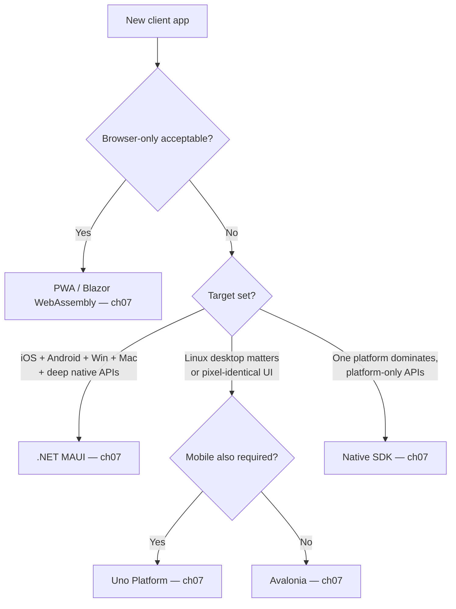
```mermaid
flowchart TD
    A[New client app] --> B{Browser-only acceptable?}
    B -->|Yes| C[PWA / Blazor WebAssembly — ch07]
    B -->|No| D{Target set?}
    D -->|iOS + Android + Win + Mac<br/>+ deep native APIs| E[.NET MAUI — ch07]
    D -->|Linux desktop matters<br/>or pixel-identical UI| F{Mobile also required?}
    F -->|Yes| G[Uno Platform — ch07]
    F -->|No| H[Avalonia — ch07]
    D -->|One platform dominates,<br/>platform-only APIs| I[Native SDK — ch07]
```

References: [`docs/07-client.md#part-2--maui-net-10`](./07-client.md#part-2-maui-net-10).

---

## 7. Test type: unit vs WebApplicationFactory vs Testcontainers vs Aspire

- Trigger: deciding where a new test belongs.
- Cost of wrong call: an integration suite that boots the world for every
  pure-function check, or a unit suite that mocks the database and proves
  nothing about the SQL.
- Default per `ch04`: unit tests for pure logic; `WebApplicationFactory` for
  in-process HTTP + DI; Testcontainers when a real engine is the contract;
  `DistributedApplicationTestingBuilder` (Aspire) when the system under test
  is multi-resource.

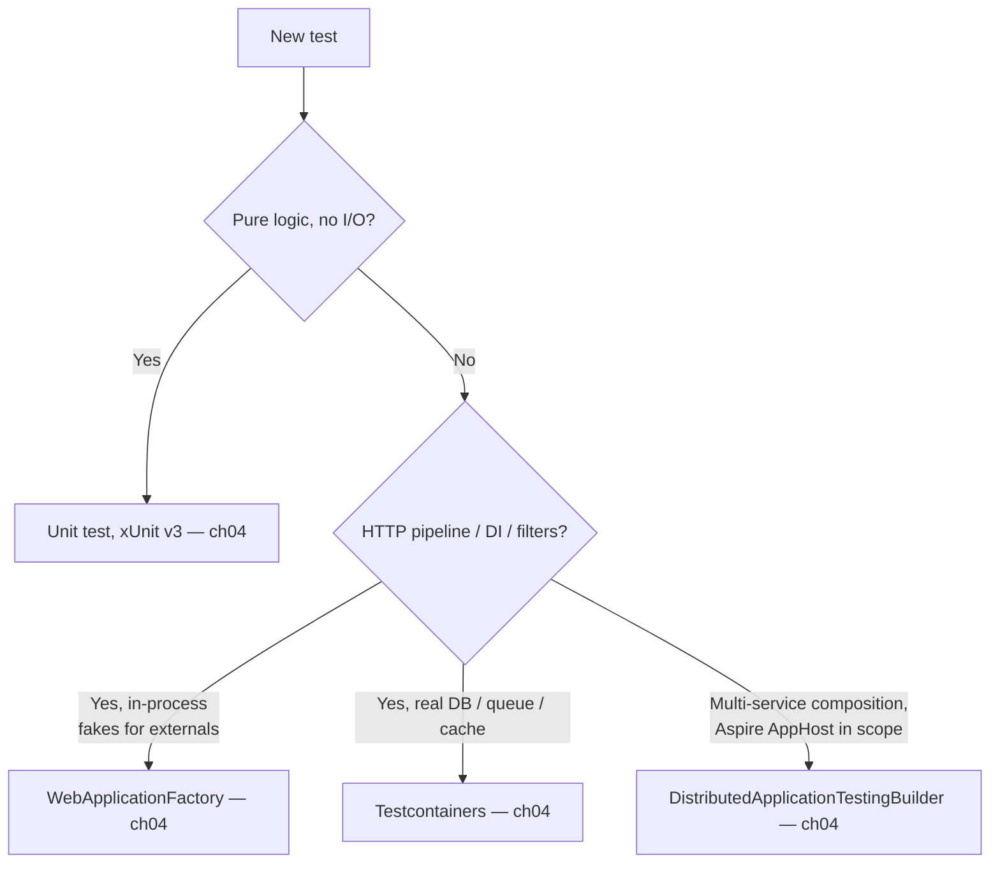
```mermaid
flowchart TD
    A[New test] --> B{Pure logic, no I/O?}
    B -->|Yes| C[Unit test, xUnit v3 — ch04]
    B -->|No| D{HTTP pipeline / DI / filters?}
    D -->|Yes, in-process<br/>fakes for externals| E[WebApplicationFactory — ch04]
    D -->|Yes, real DB / queue / cache| F[Testcontainers — ch04]
    D -->|Multi-service composition,<br/>Aspire AppHost in scope| G[DistributedApplicationTestingBuilder — ch04]
```

References: [`docs/04-testing.md#5-webapplicationfactory-for-aspnet-core`](./04-testing.md#5-webapplicationfactory-for-aspnet-core), [`docs/04-testing.md#6-testcontainers`](./04-testing.md#6-testcontainers).

---

## 8. Assertion library after FluentAssertions' relicense

- Trigger: a new test project, or a re-evaluation prompted by
  FluentAssertions 8's commercial licence.
- Cost of wrong call: locking the org into a paid licence by reflex, or
  rewriting 50k assertions to chase a fashionable replacement.
- Default per `ch04`: built-in `Assert` for new projects unless a specific
  feature is needed; AwesomeAssertions as a drop-in fork; Shouldly for
  fluent style; TUnit when you are also moving runners; Verify for
  snapshot-shaped tests.

```mermaid
flowchart TD
    A[New / migrating test project] --> B{Snapshot / approval shape?}
    B -->|Yes| C[Verify — ch04]
    B -->|No| D{Need fluent .Should() syntax?}
    D -->|No| E[Built-in Assert — ch04]
    D -->|Yes| F{Drop-in replacement<br/>for FluentAssertions API?}
    F -->|Yes| G[AwesomeAssertions — ch04]
    F -->|No, prefer Shouldly DSL| H[Shouldly — ch04]
    D -->|Also switching runner| I[TUnit + its assertions — ch04]
```

References: [`docs/04-testing.md#3-assertions`](./04-testing.md#3-assertions).

---

## 9. NativeAOT vs JIT

- Trigger: a service whose cold start, memory footprint, or single-file
  deploy story matters (Functions, sidecars, CLIs, container scale-to-zero).
- Cost of wrong call: AOT-compiling code that uses reflection-heavy
  serialisers, dynamic plugin loading, or `Expression.Compile`; or paying
  JIT warm-up on a workload that scales from zero hundreds of times a day.
- Default per `ch05`: JIT. Pick AOT only when cold-start is on the SLO and
  every dependency is AOT-vetted.

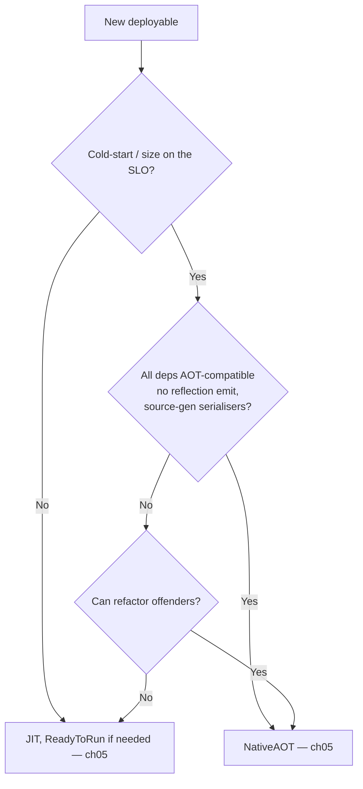
```mermaid
flowchart TD
    A[New deployable] --> B{Cold-start / size on the SLO?}
    B -->|No| C[JIT, ReadyToRun if needed — ch05]
    B -->|Yes| D{All deps AOT-compatible<br/>no reflection emit,<br/>source-gen serialisers?}
    D -->|Yes| E[NativeAOT — ch05]
    D -->|No| F{Can refactor offenders?}
    F -->|Yes| E
    F -->|No| C
```

References: [`docs/05-performance.md#8-jit--aot`](./05-performance.md#8-jit-aot).

---

## 10. Server GC vs Workstation GC

- Trigger: a new process that is not an ASP.NET Core app on a server SKU
  (where Server GC is already on by default).
- Cost of wrong call: Workstation GC on a multi-core server costs throughput
  and tail latency; Server GC in a 200 MB sidecar pins a heap-per-core and
  wastes RAM.
- Default per `ch05`: Server GC for multi-core server workloads; Workstation
  GC for desktop apps and small sidecars; consider DATAS on .NET 8+ when
  memory pressure is dynamic.

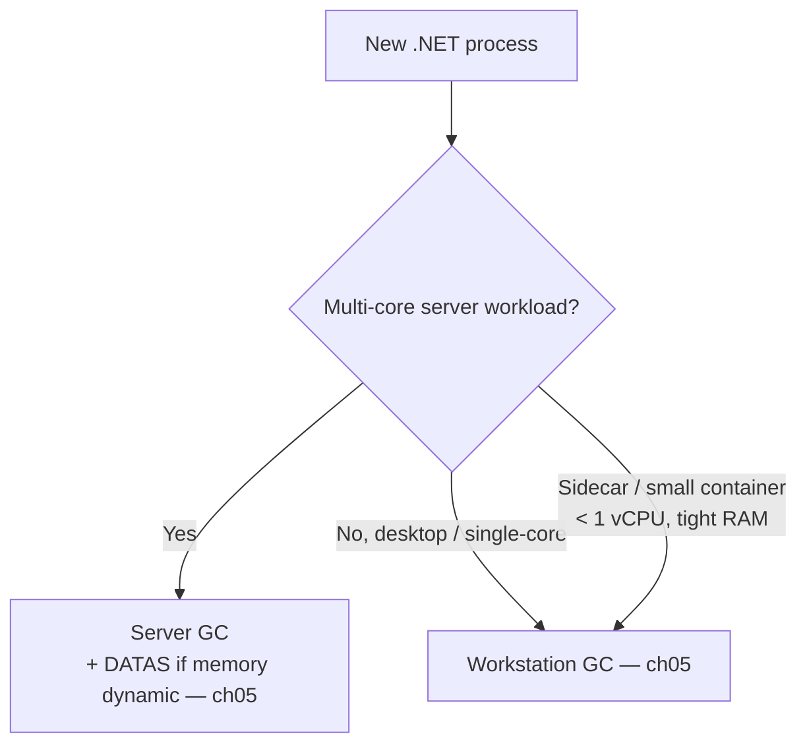
```mermaid
flowchart TD
    A[New .NET process] --> B{Multi-core server workload?}
    B -->|Yes| C[Server GC<br/>+ DATAS if memory dynamic — ch05]
    B -->|No, desktop / single-core| D[Workstation GC — ch05]
    B -->|Sidecar / small container<br/>< 1 vCPU, tight RAM| D
```

References: [`docs/05-performance.md#9-gc`](./05-performance.md#9-gc).

---

## 11. HTTP client: IHttpClientFactory vs long-lived HttpClient

- Trigger: any outbound HTTP call from a long-running .NET process.
- Cost of wrong call: `new HttpClient()` per call exhausts sockets; a
  singleton `HttpClient` without `PooledConnectionLifetime` pins stale DNS
  for the life of the process.
- Default per `ch01`: `IHttpClientFactory` (typed clients) inside DI'd apps;
  a singleton `HttpClient` with `SocketsHttpHandler { PooledConnectionLifetime }`
  for tiny tools and console apps.

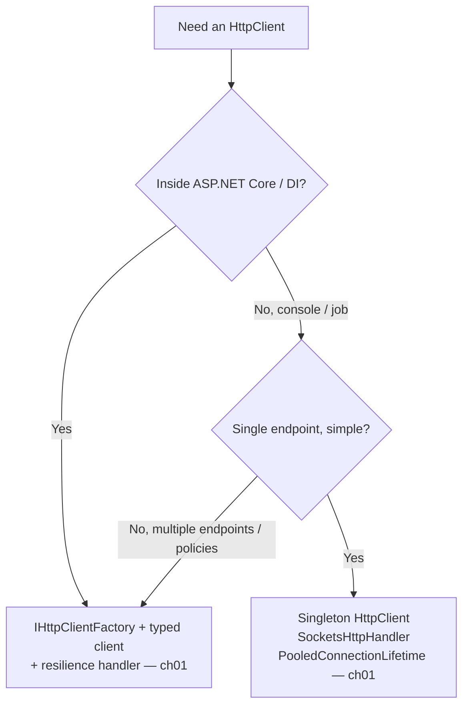
```mermaid
flowchart TD
    A[Need an HttpClient] --> B{Inside ASP.NET Core / DI?}
    B -->|Yes| C[IHttpClientFactory + typed client<br/>+ resilience handler — ch01]
    B -->|No, console / job| D{Single endpoint, simple?}
    D -->|Yes| E[Singleton HttpClient<br/>SocketsHttpHandler<br/>PooledConnectionLifetime — ch01]
    D -->|No, multiple endpoints / policies| C
```

References: [`docs/01-foundations.md#5-di--lifetimes`](./01-foundations.md#5-di-lifetimes), [`docs/02-aspnetcore.md#11-httpclient`](./02-aspnetcore.md#11-httpclient).

---

## 12. Auth policy shape: delegated (`scp`) vs app-only (`roles` + `azp`)

- Trigger: protecting an endpoint that may be hit by delegated users,
  app-only callers, or both.
- Cost of wrong call: a single OR-claims policy that lets an app-only token
  reach a user-only endpoint (no `azp` allow-list, no `scp` check), or a
  user token satisfy an app-only endpoint by carrying an unrelated `scp`.
  Both are real privilege-escalation bugs in production APIs.
- Default per `ch02` §10: **two separate named policies** — one delegated
  (requires `scp` and a specific scope, rejects tokens that carry `roles`
  but no `scp`), one app-only (requires `roles`, an `azp`/`appid` in an
  allow-list, and the **absence** of `scp`). For endpoints that legitimately
  accept both, list both policies on the endpoint
  (`RequireAuthorization("OrdersReadDelegated", "OrdersReadApp")`); each
  policy still enforces its own invariants. **Never** a single assertion
  that ORs `scp` and `roles`.

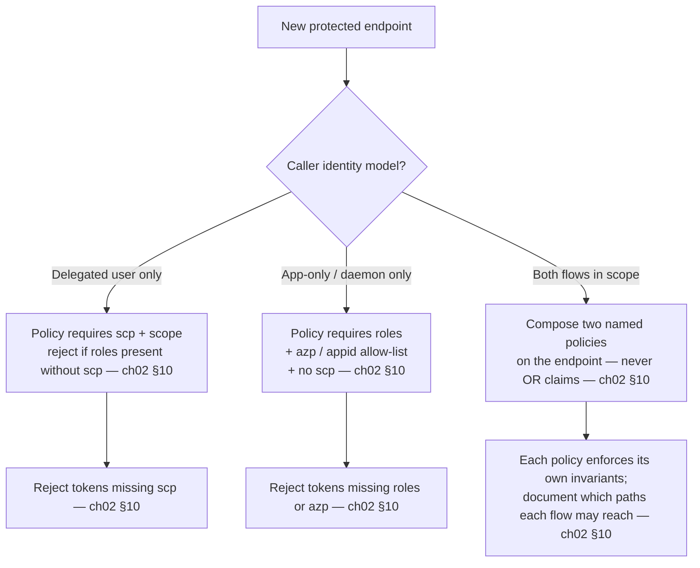
```mermaid
flowchart TD
    A[New protected endpoint] --> B{Caller identity model?}
    B -->|Delegated user only| C[Policy requires scp + scope<br/>reject if roles present without scp — ch02 §10]
    B -->|App-only / daemon only| D[Policy requires roles<br/>+ azp / appid allow-list<br/>+ no scp — ch02 §10]
    B -->|Both flows in scope| E[Compose two named policies<br/>on the endpoint — never OR claims — ch02 §10]
    C --> F[Reject tokens missing scp — ch02 §10]
    D --> G[Reject tokens missing roles or azp — ch02 §10]
    E --> H[Each policy enforces its own invariants;<br/>document which paths each flow may reach — ch02 §10]
```

References: [`docs/02-aspnetcore.md#10-authnauthz`](./02-aspnetcore.md#10-authnauthz).

---

## 13. Caching: OutputCache vs HybridCache vs IDistributedCache

- Trigger: introducing a cache to hide latency or cost.
- Cost of wrong call: caching whole HTTP responses when you needed a domain
  object; rolling your own L1+L2 with stampede protection that HybridCache
  ships out of the box.
- Owner split: **`OutputCache` is owned by [`ch02 §9`](./02-aspnetcore.md#9-output-caching)**
  (HTTP-response middleware). **`HybridCache` and `IDistributedCache` are
  owned by [`ch03 §14`](./03-data.md#14-caching)** (data-shaped caches —
  the matrix in ch03 §14 is for app data, not HTTP responses).

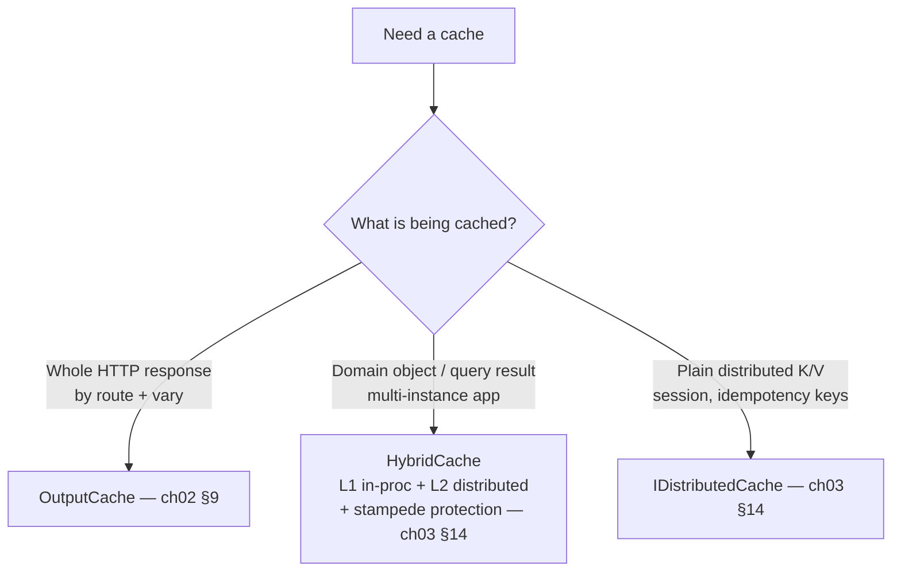
```mermaid
flowchart TD
    A[Need a cache] --> B{What is being cached?}
    B -->|Whole HTTP response<br/>by route + vary| C[OutputCache — ch02 §9]
    B -->|Domain object / query result<br/>multi-instance app| D[HybridCache<br/>L1 in-proc + L2 distributed<br/>+ stampede protection — ch03 §14]
    B -->|Plain distributed K/V<br/>session, idempotency keys| E[IDistributedCache — ch03 §14]
```

References: [`docs/02-aspnetcore.md#9-output-caching`](./02-aspnetcore.md#9-output-caching) (OutputCache owner), [`docs/03-data.md#14-caching`](./03-data.md#14-caching) (HybridCache / `IDistributedCache` owner).

---

## 14. Kubernetes pod QoS: Guaranteed vs Burstable

- Trigger: setting `requests` and `limits` on a new Deployment or
  StatefulSet.
- Cost of wrong call: latency-sensitive workloads in Burstable get throttled
  and evicted under pressure; bursty batch jobs in Guaranteed pin capacity
  the cluster could have packed.
- Default per `ch06`: Guaranteed (request == limit) for latency-sensitive
  request paths; Burstable for background workers and dev/test; never
  BestEffort in production.

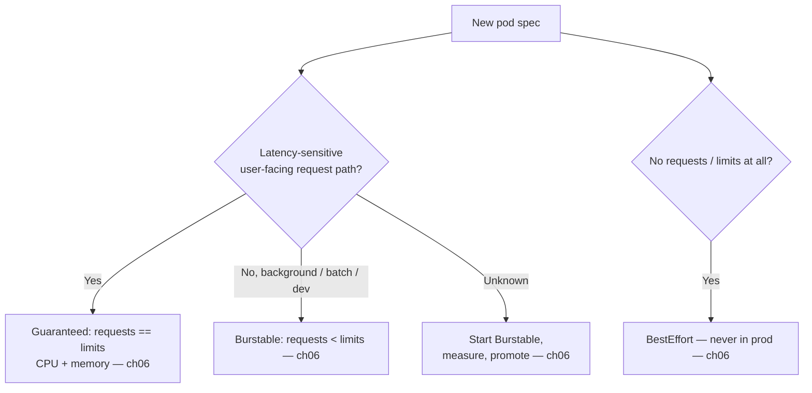
```mermaid
flowchart TD
    A[New pod spec] --> B{Latency-sensitive<br/>user-facing request path?}
    B -->|Yes| C[Guaranteed: requests == limits<br/>CPU + memory — ch06]
    B -->|No, background / batch / dev| D[Burstable: requests < limits — ch06]
    B -->|Unknown| E[Start Burstable,<br/>measure, promote — ch06]
    A --> F{No requests / limits at all?}
    F -->|Yes| G[BestEffort — never in prod — ch06]
```

References: [`docs/06-cloud-native.md#3-kubernetes--aks--probes-limits-gc-shutdown`](./06-cloud-native.md#3-kubernetes-aks-probes-limits-gc-shutdown).

---

## 15. Resilience: standard handler vs custom Polly vs hedging

- Trigger: an outbound HTTP dependency that can fail, slow down, or rate-limit
  you.
- Cost of wrong call: hand-rolling a retry loop that retries non-idempotent
  POSTs, or reaching for hedging on a write path and amplifying load.
- Default per `ch02` §7 (single owner; ch06 references this section):
  `AddStandardResilienceHandler()` on every typed `HttpClient`; a custom
  Polly v8 pipeline only when the standard defaults do not fit; hedging
  strictly for idempotent fan-out reads. The standard handler retries safe
  verbs (GET, HEAD, OPTIONS, PUT, DELETE) by default and skips POST/PATCH —
  retry POST only when the server exposes an idempotency-key contract.

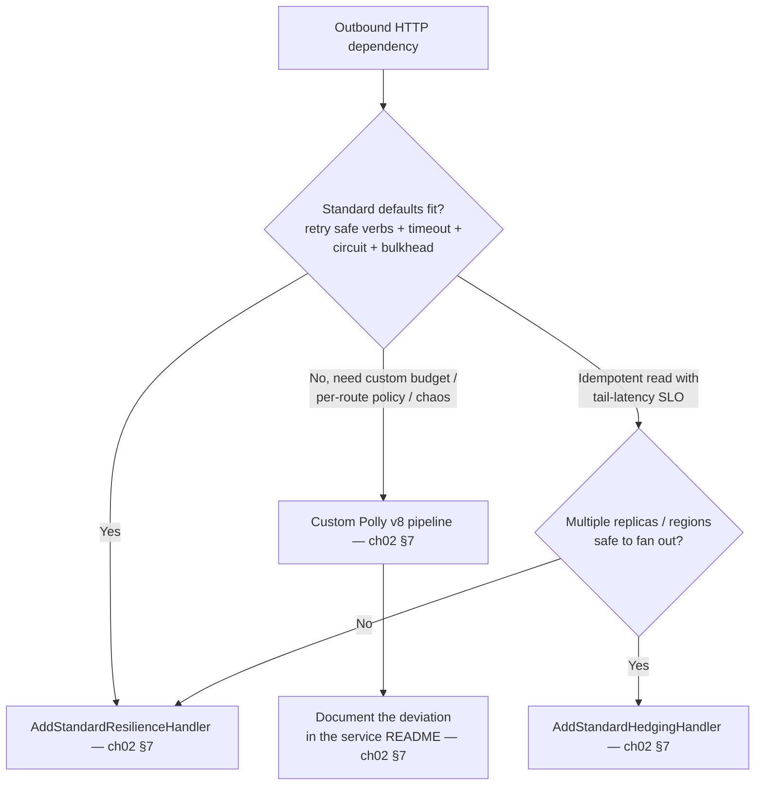
```mermaid
flowchart TD
    A[Outbound HTTP dependency] --> B{Standard defaults fit?<br/>retry safe verbs + timeout +<br/>circuit + bulkhead}
    B -->|Yes| C[AddStandardResilienceHandler — ch02 §7]
    B -->|No, need custom budget /<br/>per-route policy / chaos| D[Custom Polly v8 pipeline — ch02 §7]
    B -->|Idempotent read with<br/>tail-latency SLO| E{Multiple replicas / regions<br/>safe to fan out?}
    E -->|Yes| F[AddStandardHedgingHandler — ch02 §7]
    E -->|No| C
    D --> G[Document the deviation<br/>in the service README — ch02 §7]
```

References: [`docs/02-aspnetcore.md#7-resilience`](./02-aspnetcore.md#7-resilience).

---

## 16. Aspire scope: AppHost resource vs in-service client integration

- Trigger: adopting a new Aspire integration (Postgres, Redis, Service Bus,
  Azure Storage, …) and choosing where the `PackageReference` lives.
- Cost of wrong call: shipping `Aspire.Hosting.*` packages to production
  service images (they are inner-loop-only and pull in container/orchestration
  code that has no business in a deployed service), or wiring an
  `Aspire.<Vendor>.<Tech>` client into the AppHost (so the dashboard and
  resource model lose visibility into the dependency).
- Default per `ch06` §1: `Aspire.Hosting.*` packages live **only** in the
  AppHost project (`*.AppHost.csproj`) — they model resources for
  `dotnet run` / `aspire run`. `Aspire.<Vendor>.<Tech>` client integrations
  live in the **service** project that consumes the resource — they register
  typed clients in DI, OTel instrumentation, and health checks.

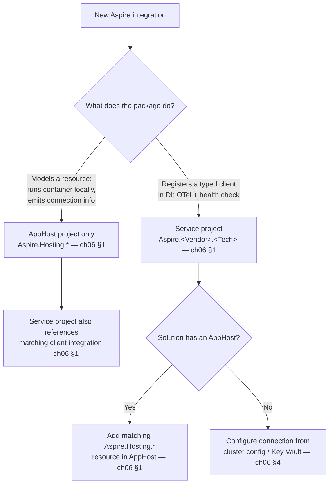
```mermaid
flowchart TD
    A[New Aspire integration] --> B{What does the package do?}
    B -->|Models a resource:<br/>runs container locally,<br/>emits connection info| C[AppHost project only<br/>Aspire.Hosting.* — ch06 §1]
    B -->|Registers a typed client<br/>in DI: OTel + health check| D[Service project<br/>Aspire.&lt;Vendor&gt;.&lt;Tech&gt; — ch06 §1]
    C --> E[Service project also references<br/>matching client integration — ch06 §1]
    D --> F{Solution has an AppHost?}
    F -->|Yes| G[Add matching Aspire.Hosting.*<br/>resource in AppHost — ch06 §1]
    F -->|No| H[Configure connection from<br/>cluster config / Key Vault — ch06 §4]
```

References: [`docs/06-cloud-native.md#1-net-aspire--what-it-is-what-it-isnt`](./06-cloud-native.md#1-net-aspire-what-it-is-what-it-isnt).

---

## 17. Cosmos DB partition key

- Trigger: modeling a new container in Azure Cosmos DB (NoSQL API).
- Cost of wrong call: a low-cardinality or write-skewed key creates hot
  logical partitions, throttles RU/s, and forces cross-partition queries
  on the dominant read path — every fix is a data migration, not a config
  change.
- Default per `ch03` §1 / §8: pick the property that is (a) **high
  cardinality**, (b) **present on the dominant read path** so the query is
  single-partition, and (c) **write-distributed** so no single tenant /
  user / day pins one logical partition. If two read patterns conflict,
  duplicate the document into a second container keyed for the other
  pattern (CDC / change-feed) before you reach for cross-partition fan-out.

```mermaid
flowchart TD
    A[New Cosmos container] --> B{Dominant read pattern<br/>known?}
    B -->|No| C[Stop. Model the read pattern first — ch03 §1]
    B -->|Yes| D{Candidate key on every<br/>dominant read query?}
    D -->|No| E[Pick a different key,<br/>or duplicate via change feed — ch03 §8]
    D -->|Yes| F{High cardinality<br/>+ write-distributed?}
    F -->|No, hot tenant / day / user| G[Composite key:<br/>tenantId + hash(id) or<br/>tenantId + bucket — ch03 §8]
    F -->|Yes| H[Use the candidate key<br/>as partition key — ch03 §8]
    H --> I{Second read pattern<br/>also dominant?}
    I -->|Yes| J[Second container,<br/>fed by change feed,<br/>keyed for that pattern — ch03 §8]
    I -->|No| K[Done — ch03 §8]
```

References: [`docs/03-data.md#1-choosing-the-tool`](./03-data.md#1-choosing-the-tool), [`docs/03-data.md#8-provider-notes`](./03-data.md#8-provider-notes).

---

## Closing rule

Every tree above picks a side.
Disagree by reading the cited chapter and finding a different rule there —
not by adding a branch.
This page is synthesis, not a menu.
